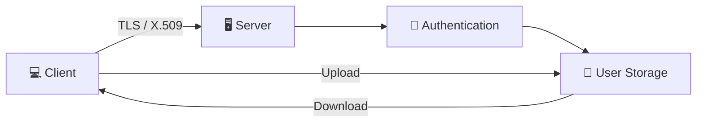

# Secure File Synchronization System

A Python client-server project that combines authenticated file access, TLS/X.509 certificate setup, user-specific storage, and automatic file synchronization between clients and a server.

## System Architecture



## Highlights

- Python socket-based client/server architecture
- TLS/X.509 certificate setup with OpenSSL
- Elliptic-curve key generation
- Password hashing and account authentication
- Multiple client directories
- Automatic file watching and synchronization
- Upload, download, modification, and deletion handling
- Multithreaded server behavior

## Files

- `server.py` — server-side networking, authentication, storage, and synchronization logic
- `client.py` — client interface and synchronization logic
- `setup_certificates.sh` — installs required Python packages and generates local certificates/keys

## Setup

Create and activate a Python 3 virtual environment, then run:

```bash
bash setup_certificates.sh
```

The setup script installs the Python packages used by the project and generates the CA, server, and client certificate material.

During certificate creation, the current implementation expects these Common Names:

- CA: `CA`
- Server: `Server`
- Client: `Client`

The challenge password used by the original implementation is `cookie`.

After generation, place the server certificate files with `server.py` and the client certificate files with `client.py` as expected by the source code.

## Running

Start the server in one terminal:

```bash
python server.py
```

Start a client in another terminal:

```bash
python client.py
```

A second client can be run from a separate client directory to demonstrate synchronization between users/clients.

## Synchronization

Once authenticated, the client watches its user directory for file changes. Creating, modifying, or deleting files triggers synchronization jobs that are communicated to the server and propagated to clients.

## Known Limitations

This is an educational project rather than a production file-storage system. The original implementation can take time to propagate some changes between clients, and deletion operations can produce inconsistent file movement in some cases.

## Security Note

Private keys and generated certificate material are intentionally excluded from this repository. Generate them locally with `setup_certificates.sh`. Do not commit generated `.key` files.
